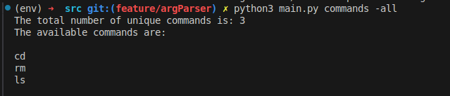
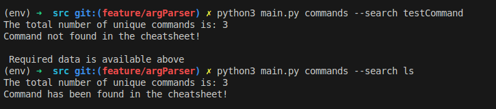
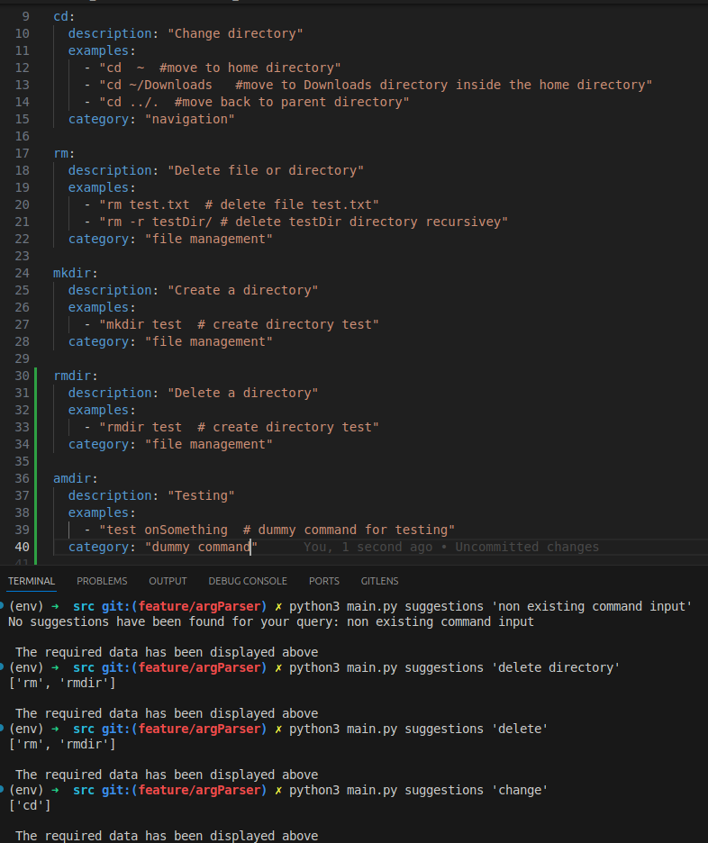
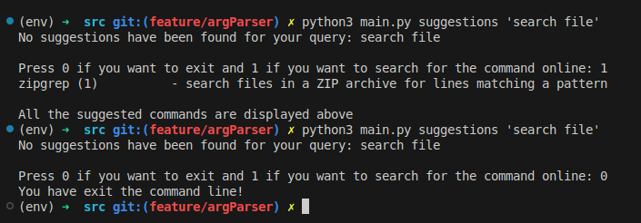

# linuxCheatsheet_CLI
a Linux command cheatsheet CLI tool in Python

Currently, the cheatsheet will focus on 5 commands, which are also the most common ones:

1. ls

2. cd

3. pwd

4. mkdir

5. rm 

As the project progresses, new commands will be appended to the cheatsheet CLI iteratively. 

How to setup the project on your local (For Ubuntu distribution):

1. If you want to contribute to the project, fork the repo and clone it in your local system (Prerequisite: Installed git)
2. Once cloning is complete, open your IDE and move to the 'linuxCheatsheet_CLI' directory
3. Activate the virtual environment using the command: source env/bin/activate from inside the 'linuxCheatsheet_CLI' directory
4. Have a look at the requirements.txt file and install all of them recursively in your virtual environment
5. Once its done, move to the 'src' directory and then run any of the below mentioned commands while maintaining the structure

How to use this from the terminal (All of these below mentioned commands should be run from inside the src directory):

1. on running: python3 main.py -h or python3 main.py --help, the user can get a generalised description about the CLI tool
2. on running: python3 main.py commands from the terminal, the total number of commands stored in the cheatsheet is displayed
3. on runnign: python3 main.py categories, the number of categories is displayed in the terminal 
4. on running: python3 main.py commands -all, all the commands in the cheatsheet are displayed in the terminal   

5. on running: python3 main.py categories -all, all the categories are displayed in the terminal

6. To check if a particular command exists in the cheatsheet, enter: python3 main.py commands --search command_name. Replace the command name with 
any command that you want to be searched.

7. To ask for suggestions on commands from the cheatsheet, enter: python3 main.py suggestions 'your input'. Replace your input with your actual input
and command suggestions will be prompted out to the terminal. 
Important: if your input is only 1 word, there is no need to enclose it in strings else if it is > 1 word, you have to enclose it in strings. 

As it can be seen in the above image, the commands are suggested to the user if even a part of the existing command's description matches with that of the
user input. If there is no match, a message is printed to the terminal signalling that no matches have been found. 

8. In case a command does not exist in the cheatsheet, the user also has the choice to search for the command in all the manual pages. To do so,
the user first has to search for the commands suggestion using the command:  python3 main.py suggestions 'user query' - replace user query with the 
actual query

Now, if suggestions are not found in the cheatsheet, the terminal will prompt you to enter 1 in order to search for suggestions from manual pages. On 
entering 1, the query will be searched from among the manual page command entries and all matches will be displayed to the terminal directly. 

9. To check the current ip address (v4 and v6), you can use these commands: python3 main.py network ipaddress (for ipv4 address - inet) and the the same 
command with -v6 flag to display the v6 version: python3 main.py network ipaddress -v6 (for ipv6 address - ipv6)